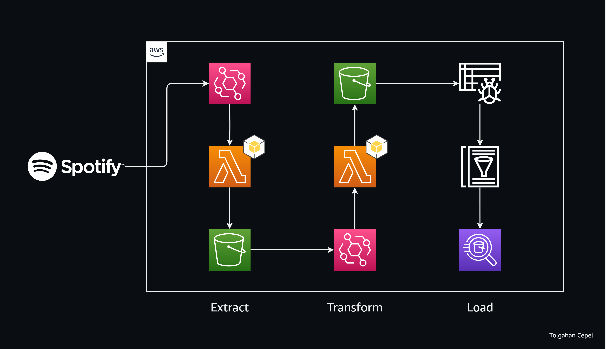

# Spotify Data Processing ETL Pipeline on AWS

## Project Structure

## Overview
End-to-end data engineering pipeline that retrieves "Top 50 Songs in Turkey" from Spotify API by leveraging AWS Cloud Services. This pipeline orchestrates daily data retrievals, allowing for analysis through Amazon Athena queries.

## Tools Used
- **Jupyter Notebooks:** Utilized for initial data exploration, analysis, and establishing a baseline for data extraction.
- **Amazon S3**: Used as a data lake to store raw and processed data from Spotify API.
- **AWS Lambda**: Executing the Python scripts for data extraction and transformation.
- **AWS Glue Catalog**: Serves as a metadata repository for storing table definitions and schema information for processed data.
- **Amazon Athena**: Allows for querying data directly from Amazon S3 using SQL-like queries.
- **AWS EventBridge**: Setting up daily execution cycles for ETL jobs.
- **AWS CloudWatch**: Monitors and logs activities within the pipeline, providing insights.

## Getting Started
1. Clone this repository.
2. Review the Jupyter Notebooks in the `notebooks` directory for initial exploration and setup.
3. Explore the Python scripts in the `lambda_functions` directory for AWS Lambda functions.
4. Create AWS Cloud services by following the diagram and modifying the source code.

## License
This project is licensed under MIT License - see the [LICENSE](LICENSE) file for details.
